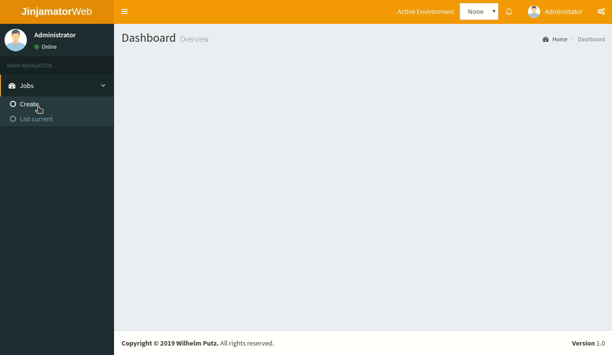
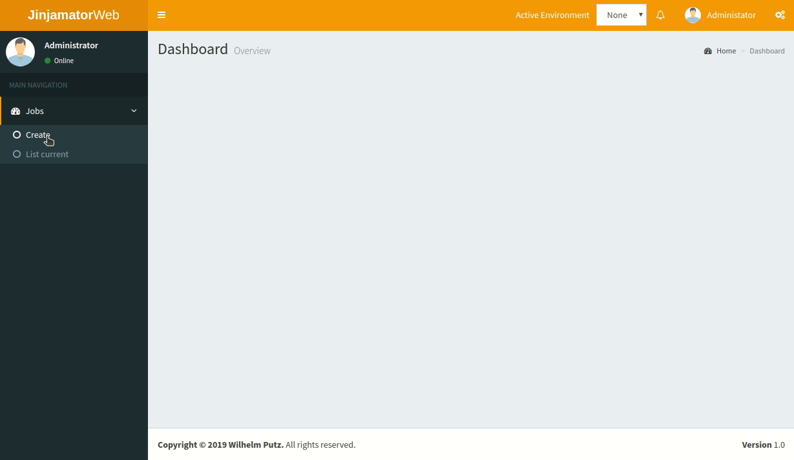

Hello World
-------------
This example just asks you to input the value for a variable named var_name and returns this value as string 'Hello <data you typed in>'
Just to show you that python and jinja2 are handled totally equal, this example is written in both languages.

Python:

.. literalinclude:: python/01-hello-world.py
  :language: python

Jinja2:

.. literalinclude:: jinja2/01-hello-world.j2
  :language: js+jinja

Run The Task Via CLI
**********************

run the python task

.. code-block:: bash

    jinjamator -t <path to examples>/01-hello-world-minimal/python

run the jinja2 task

.. code-block:: bash

    jinjamator -t <path to examples>/01-hello-world-minimal/jinja2

Run The Task Via WebGUI
***************************
To start the daemon run jinjamator with following command.

.. code-block:: bash

    jinjamator --task-base-dir <path to examples>  -d -vvv

Then open a browser and open http://localhost:5000

run the python task

run the jinja2 task

as you can see, there is no difference between the output of the python and the jinja2 task.
